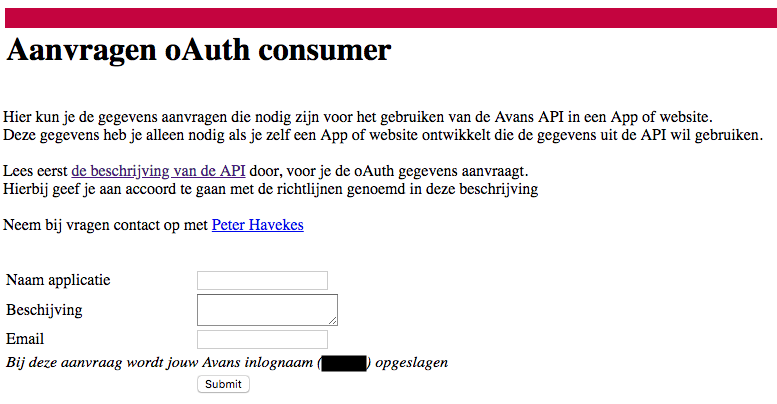
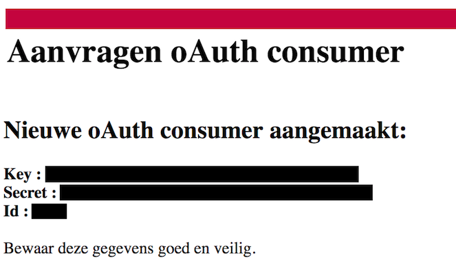

# AvansRealtimeServer

Avans Realtime Server

```
┌────────────────┬───────────────────────────────────────┬─────────────────────────────────────────────────────────┐
│ Method         │ Endpoint                              │ Class method                                            │
│────────────────│───────────────────────────────────────│─────────────────────────────────────────────────────────│
│ POST           │ /api/v1/user/                         │ UserController.createUser()                             │
│────────────────│───────────────────────────────────────│─────────────────────────────────────────────────────────│
│ POST           │ /api/v1/user/authorize                │ UserController.authorize()                              │
│────────────────│───────────────────────────────────────│─────────────────────────────────────────────────────────│
│ GET            │ /api/v1/user/whoAmI                   │ UserController.whoAmI()                                 │
│────────────────│───────────────────────────────────────│─────────────────────────────────────────────────────────│
│ GET            │ /api/v1/avans/authentication/start    │ AuthenticationController.onAvansAuthorizationStart()    │
│────────────────│───────────────────────────────────────│─────────────────────────────────────────────────────────│
│ GET            │ /api/v1/avans/authentication/callback │ AuthenticationController.onAvansAuthorizationCallback() │
│────────────────│───────────────────────────────────────│─────────────────────────────────────────────────────────│
│ ALL            │ /api/v1/                              │ RestController.all()                                    │
│────────────────│───────────────────────────────────────│─────────────────────────────────────────────────────────│
│ GET            │ /api/v1/                              │ RestController.getRoutes()                              │
└────────────────┴───────────────────────────────────────┴─────────────────────────────────────────────────────────┘

```

# Requirements

1. Install NodeJS more information [here](https://nodejs.org/en/download/)
2. Install yarn more information [here](https://yarnpkg.com/lang/en/docs/install/)
3. Install mongoDB more information [here](https://docs.mongodb.com/manual/installation/#tutorials)

# Installing

### Step 1 - Clone & Install
```
git clone https://github.com/Kapulara/AvansRealtimeServer.git
cd AvansRealtimeServer
cp .example.env .env
yarn install
```

### Step 2 - Register Application

Register application at: [https://publicapi.avans.nl/newconsumer/](https://publicapi.avans.nl/newconsumer/)



Write down the key, secret and id in a secure location.



Edit file `AvansRealtimeServer/.env`:

```diff
...

# Avans
# Register here for Consumer key / secret => https://publicapi.avans.nl/newconsumer/
- CONSUMER_KEY=
- CONSUMER_SECRET=
+ CONSUMER_KEY=<received key>
+ CONSUMER_SECRET=<received secret>

...
```

### Step 3 - Register User

Locate to [http://localhost:3333/api/v1/avans/authentication/start](http://localhost:3333/api/v1/avans/authentication/start) in the browser. It should redirect you to the avans login portal.

Login with your credentials and you will be redirected back to the application. And you should be presented with some information about your current user. 

Now the API is in a *very early* stage so there is nothing you can really do with it right now. However you can   

### (*optional*) Step 4 - Running the Server with https locally
```
mkdir keys
cd keys
openssl req -x509 -subj '/CN=localhost' -newkey rsa:4096 -keyout key.pem -out cert.pem -days 365
```
Give it a few seconds until it asks for a PEM pass phrase. Generate a secure passphrase and save this in a secure location e.g password manager.

```
Generating a 4096 bit RSA private key
................................................................................++
..........................................++
writing new private key to 'key.pem'
Enter PEM pass phrase:
```

Edit file `AvansRealtimeServer/.env`:

```diff
...

# Certs
- ENABLE_HTTPS=false
- PEM_PASSPHRASE=0123456789
+ ENABLE_HTTPS=true
+ PEM_PASSPHRASE=<passphrase you used>

...
```

Generate a secure phrase.
